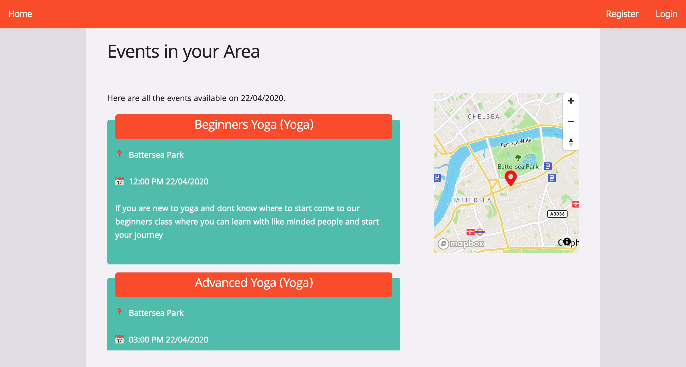

# Software Engineering Immersive: Project 3
This is my third project of the General Assembly Software Engineering Immersive course (Week 8). It was a 7 day four-person group project.

## Team Mates

- [Christine Kapak](https://github.com/ckapak)
- [Dide Mertens](https://github.com/didemertens)
- [Jesse Golding](https://github.com/Jesse2889)

## Installation

* Clone or download the Repository
* From the project root folder, enter the following commands into the terminal:

```
<!— To install all the packages listed in the package.json: —> $ yarn 

<!- Navigate into the shell -> $ yarn seed

<!— Run the app from your localhost: —> $ yarn start

<!— Check the console for any issues and if there are any then check the package.json for any missing dependencies —>

<!- Navigate to http://localhost:4000/>
```

## Deployment

The game is deployed on Heroku and can be found [here](out-and-about-activities.herokuapp.com).

## Technologies Used

* MongoDB
* Express
* React
* Node.js
* SCSS
* Skeleton
* Mocha
* Chai
* Mapbox
* Cloudinary
* Google Fonts
* Git
* GitHub

## Website Architecture

### Overview

The purpose of the website is to to encourage people to be more active and social by allowing users to create events and participate in free outdoor activities.

### Homepage

The home page provides a short description of exactly what the website is used for and enables the user to search community events based on activity type, location, date and time. These search parameters are then stored in ```this.state.props.history``` whilst simultaneously moving the user on to the search results page. The date and time inputs use React Datepicker which give a more aesthetic look to the data input and break the times down into quarter-hourly options.


### Event Search Results Page

The Event Search Results page carries out an axios request on the events API from the server, together with the search parameters from the props passed through from the home page. The functionality then filters out events from past dates, then filters by activity, then by postcode, date and time.

If the search finds no events of a certain category in the chosen area, events in that category from further away are shown. Likewise, if there are no events on the user's chosen data, events of the same category on different dates are shown.



## Reflections

### Wins


### Challenges


### Future Features

