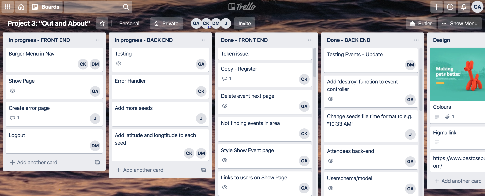
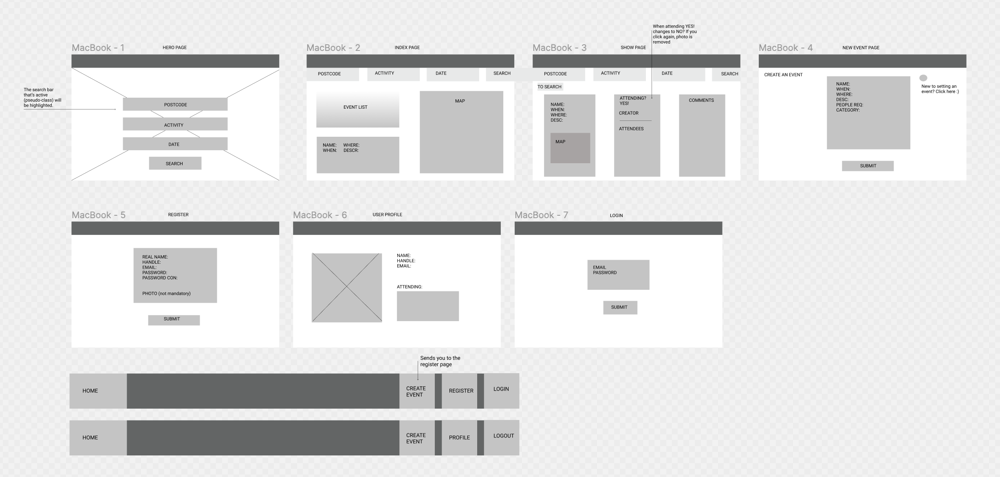
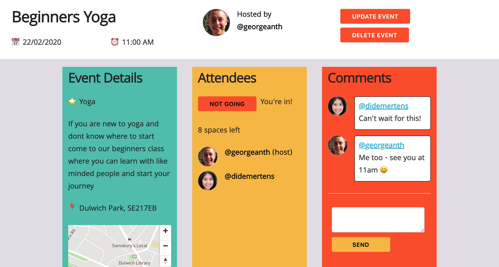
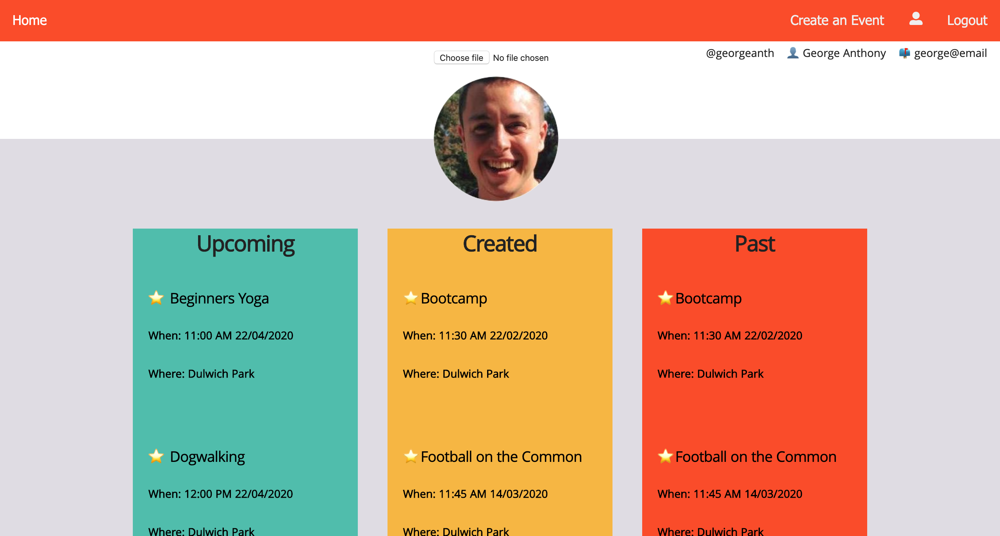

# Software Engineering Immersive: Project 3
This is my third project of the General Assembly Software Engineering Immersive course (Week 8). It was a seven day four-person group project.

## Team Mates

- [Christine Kapak](https://github.com/ckapak)
- [Dide Mertens](https://github.com/didemertens)
- [Jesse Golding](https://github.com/Jesse2889)

## Installation

* Clone or download the Repository
* From the project root folder, enter the following commands into the terminal:

```
<!— To install all the packages listed in the package.json: —>
$ yarn 

<!- Navigate into the shell ->
$ yarn seed

<!— Run the app from your localhost: —>
$ yarn start

<!— Check the console for any issues and if there are any then check the package.json for any missing dependencies —>

<!- Navigate to http://localhost:4000/>
```

## Deployment

The game is deployed on Heroku and can be found here: http://out-and-about-activities.herokuapp.com/

## Technologies Used

* MongoDB
* Express
* React
* Node.js
* SCSS
* Skeleton
* Mocha
* Chai
* Mapbox
* Cloudinary
* Google Fonts
* Git
* GitHub
* Trello
* Figma

### Project Management

We used a Trello board to organise our tasks and prevent duplication of work, setting time aside each day to assign tasks and discuss our progress. The tasks in Trello were split into "To Do", "In Progress" and "Done". We also used Trello cards for useful links, to pool design ideas and store detailed instructions for our GitHub collaboration process. We made sure to carefully follow these steps upon completing each task and communicating any Git pushes to the group using Slack.



We also used Figma to design our wireframes. This gave us a clear sense of direction from Day 1 of our project and enabled us to each have the same end goal in mind when it came to building out and designing the front end.



## Website Architecture

### Overview

The purpose of the website is to to encourage people to be more active and social by allowing users to create events and participate in free outdoor activities.

### Homepage

The home page provides a short description of exactly what the website is used for and enables the user to search community events based on activity type, location, date and time. These search parameters are then stored in ```this.state.props.history``` whilst simultaneously moving the user on to the search results page. The date and time inputs use React Datepicker which give a more aesthetic look to the data input and break the times down into quarter-hourly options.


### Event Search Results Page

The Event Search Results page carries out an axios request on the events API from the server, together with the search parameters from the props passed through from the home page. The functionality then filters out events from past dates, then filters by activity, then by postcode, date and time. The results are shown as a listing on the left hand side, with a map showing the locations of each result on the right hand side.

If the search finds no events of a certain category in the chosen area, events in that category from further away are shown. Likewise, if there are no events on the user's chosen data, events of the same category on different dates are shown.


### Event Show Page

Clicking on a specific event takes the user to the Event Show Page, where details are provided on date, time, location (including a map) and description of the event. The page also shows a list of event attendees ang gives users the option to click to attend the event themselves, which, using React, instantaneously re-renders the page to add the user to the attendees list. The comments section of the right hand side uses a similar logic, enabling users to chat with each other about plans, further details and feedback from the event. If the user is also the creator of the event, then they will see the options to update and delete the event.



### User Profile Page

The navigation bar enables users to navigate to their profile page. It is also possible to navigate to other user's profile pages (in an unauthorised capacity) through finding and clicking on event attendees.

The user profile page shows user details such as full name and email, together with past, upcoming and created events with a brief summary of the details and links to take users a specific Event Show page. If the user is on their own profile page, they also have the option to upload/change their profile image, using Cloudinary to store the uploaded image.



## My Contributions

### User Profile Back End

I built out the user model, complete with full authentication, password confirmation on registration, validation and encryption using bcrypt. Prior to axios get requests for the user's data, the model attaches two virtual fields: one for events that the user has created and another for events the user is attending, using the following code:

```JavaScript
userSchema.virtual('createdEvents', {
  ref: 'Event',
  localField: '_id',
  foreignField: 'user'
})

userSchema.virtual('attendingEvents', {
  ref: 'Event',
  localField: '_id',
  foreignField: 'attendees'
})
```

### Event Attendees

Upon clicking the "going" button on an event, I designed the back-end functionality to take the current user's ID and add this to event attendees array, as long as the user isn't already in the array. The front-end then reflects this change through changing the "going" button to a "not going" button and adding the user to the attendees list.

Upon clicking the "not going" button, the front-end goes through the list of attendees and finds the attendeeID that matches the current user's ID. It then sends this, together with the event ID, to the back-end which filters the attendees array for all IDs except the current user ID and saves. The front-end then carries out an axios get request on the updated attendee data and re-renders the page to reflect this, using the following function:

```JavaScript
handleSubmitNotAttend = async (e) => {
  e.preventDefault()
  const eventId = this.props.match.params.id
  const attendeeId = this.state.eventInfo.attendees.filter(attendee => attendee._id === FrontAuth.getPayload().sub)[0]._id
  try {
    await axios.delete(`/api/events/${eventId}/attend/${attendeeId}`, {
      headers: { Authorization: `Bearer ${FrontAuth.getToken()}` }
    })
    this.getEvent(eventId)
  } catch (err) {
    this.setState({ errors: err })
  }
}
```

I also added in the functionality to automatically set the creator of an event to be an attendee as well. The user will be automatically added to the attendees list, but is able to then click "not going", if they wish.

### Event Comments

I used a similar logic for the event comments box to that which I used for attendees, but also ensured that the Event Show controller included ```.populate('comments.user')``` to allow the front-end to populate the user for each comment. The code below was used for creating a comment in the back-end:

```JavaScript
function commentCreate(req, res) {
  req.body.user = req.currentUser
  Event
    .findById(req.params.id)
    .then(event => {
      if (!event) return res.status(404).json({ message: 'Not Found ' })
      event.comments.push(req.body)
      return event.save()
    })
    .then(event => res.status(201).json(event))
    .catch(err => res.json(err))
}
```

### Testing

I used Mocha and Chai to build 36 tests which all passed to ensure that the following controllers were functioning correctly:

* User:
  * Login
  * Register
* Events:
  * Show
  * Create
  * Index
  * Update
  * Delete

These tests uncovered an important detail we were missing with our error codes: we had initially set all unsuccessful error codes to 400. After being flagged by the tests, we were able to modify the error codes to be more aligned to the specific error being produced.

## Reflections

### Wins

* Our team showed a strong sense of togetherness and communication throughout the project. We ensured that any Git activities were carried out in line with a clear and robust step-by-step process and then communicated across the group using Slack, meaning we avoided any problematic merge conflicts
* We also maintained regular communication of ideas, updates and general project discussions which, together with thorough planning at the outset to determine our overall objective, process and design, ensured a consistent and efficient process flow. This enabled us to seamlessly pull together individually built components into one harmonious application
* Maps on both Search Result page and Event Show page are interactive, using Mapbox functionality to allow users to scroll and zoom in and out.
* Event Show page used React to provide a responsive experience for users wanting to click to attend - or not attend - events and add comments to the chat box.
* In addition to the activities already listed on the website, event creators are also given the option of suggesting additional activities to be added, by submitting an email to the Team Out and About mailbox.

### Challenges

* From a personal perspective, writing the back-end controllers for attending / not attending events and adding comments required carefully thought-out logic and ensuring that event show controllers were populated to the required depths of information.
* Writing the functionality to automatically add an event creator to the attendees required some modifications to the event model in order for the creator's data to be pulled through via the user model and correctly added to the attendees array.
* Because we used Skeleton as our styling framework alongside SCSS, we came across some cross-contamination of styling due to CSS adjustments to Skeleton classes. This was resolved by using Chrome Dev Tools to find the root of the problem and then agree on our styling className conventions moving forward.

### Key Learnings

* Thorough and well-communicated Git processes ensure minimal merge conflicts and a generally smooth collaboration process.
* Thorough testing will ensure that any minor issues or inconsistencies are flagged - the earlier that this is done, the sooner these issues can be resolved and prevented from having any knock-on effects with building the app further down the line.
* With regards to writing attending / not attending and comments controllers mentioned in the Challenges section, I developed a broader awareness of using Mongoose methods in conjunction with higher order functions for greater flexibility in my code.
* Using Moment.js makes date validation, manipulation and display much more efficient and manageable.

### Future Features

* Tests for the other controllers, such as comments and attendees, to confirm that the back-end functionality is fully bulletproof. 
* Ensure the website is mobile-responsive
* Add a weather API to the Event Show page, because most of the events are outdoor activities
* An attendance pending-acceptance feature, where, upon clicking "going", a user is added to a pending list for the creator of the list to then accept before the user is officially added to the attendees list.